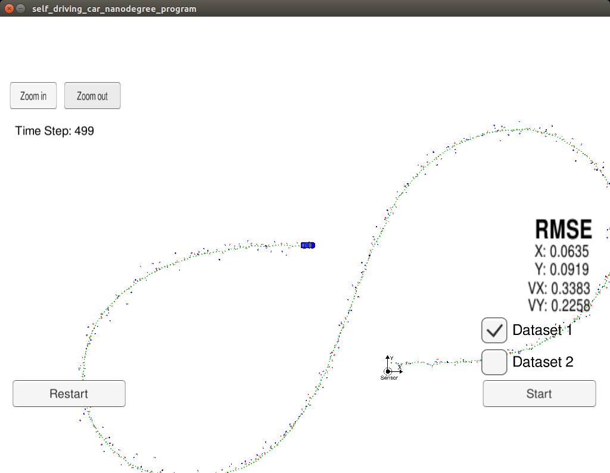
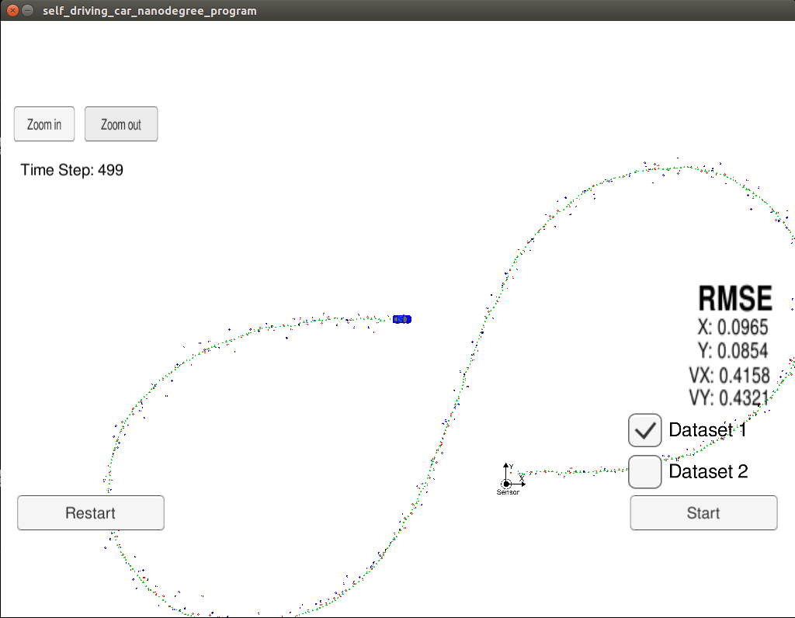
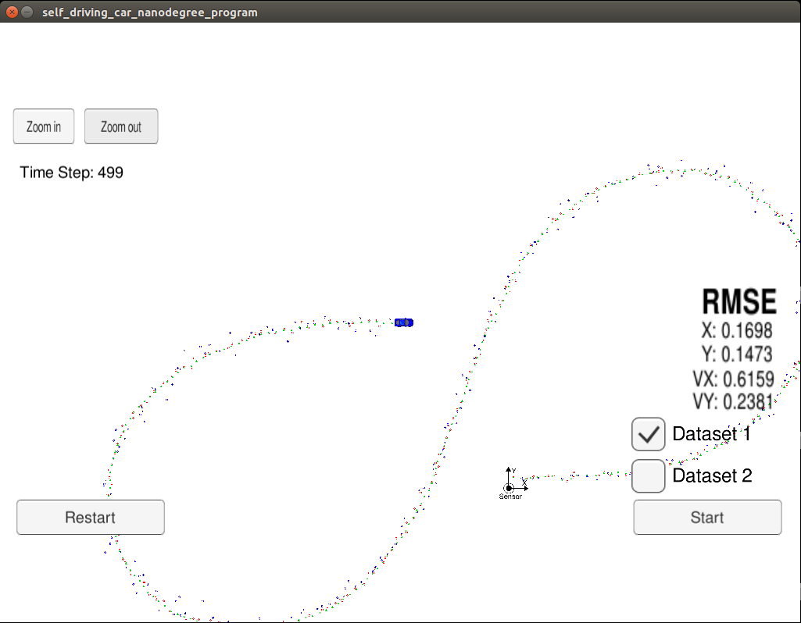
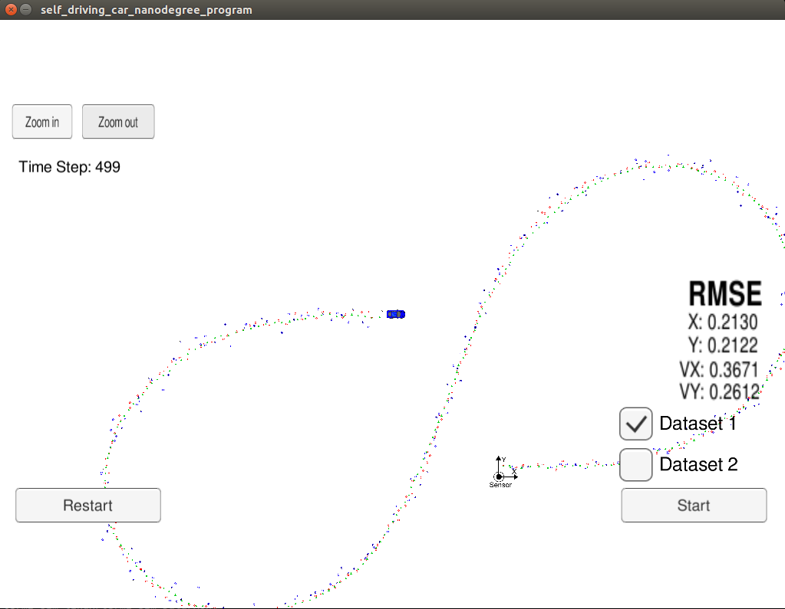

# Unscented Kalman Filter Project

Self-Driving Car Engineer Nanodegree Program

# Overview
In this project an Unscented Kalman Filter was implemented to estimate the state of a moving object of interest with noisy lidar and radar measurements. 
The project implementation achieved required RMSE values that are lower than the tolerance outlined in the project rubric. 

# Prerequisites

The project has the following dependencies:

- cmake >= 3.5
- make >= 4.1
- gcc/g++ >= 5.4
- Udacity's [simulator](https://github.com/udacity/self-driving-car-sim/releases)

Instructions on how to install the required components are available on [Udacity's original project repository](https://github.com/udacity/CarND-Unscented-Kalman-Filter-Project). 

This implementation was completed on Ubuntu 16.04.
In order to install the necessary libraries, use the [install-ubuntu.sh](./install-ubuntu.sh).

# Compiling and executing the project code

1. Clone this repo.
2. Make a build directory: `mkdir build && cd build`
3. Compile: `cmake .. && make` 
4. Run the executable: `./UnscentedKF `

The output is following:

`Usage: ./UnscentedKF <data_options>`

`Data options:`

	-L         :Use laser data only
	-R         :Use radar data only	
	-LR or -RL :Use both laser and radar data
	
Running the executable with -LR or -RL options uses data from both Laser and Radar sensors.

`./UnscentedKF -LR`

Running the executable with -L option uses only data from Laser sensor for fusion.

`./UnscentedKF -L`

Running the executable with -R option uses only data from Radar sensor for fusion.

`./UnscentedKF -R`

Anything other than the above options will be rejected and the code will exit.
	
Following is simulation final state after running the code with both Laser and Radar sensor data from dataset 1. The reported RMSE values meet the requirements of the project.



Following is the result from the previous project EKF running with Laser and Radar sensor data from dataset 1. The reported RMSE values are generally higher than the values from UKF.



Following is simulation final state after running the code with fusion of only Laser sensor data from dataset 1. The reported RMSE values are above the requirements.



Following is simulation final state after running the code with fusion of only Radar sensor data from dataset 1. The reported RMSE values are above the requirements of the project. The position RMSE values are higher than the values from Laser only data. The velocity Vx RMSE value is better than the value from Laser data. The velocity Vy RMSE seems to be comparable with the value from Laser only data.




# [Rubric](https://review.udacity.com/#!/rubrics/748/view) points

## Compiling

### The code should compile

The code compiles without errors or warnings

## Accuracy

### px, py, vx, vy output coordinates must have an RMSE <= [.09, .10, 0.40, 0.30] when using the file: "obj_pose-laser-radar-synthetic-input.txt which is the same data file the simulator uses for Dataset 1"

The values of RMSE when running the code with both Laser and Radar data and Dataset 1 are
[0.0635, 0.0919, 0.3383, 0.2258]

The tuned value of sigma for linear and angular accelerations are 0.3.

The [Normalised Innovation Square](./results/ukf_nis_result_laser_radar_dataset_1.txt) at the end of dataset 1 are following:

```
Total Radar NIS samples: 249, Current NIS value: 2.56575, Chi-Square-95 percent: 95.5823, Chi-Square-05 percent: 4.41767
Total Laser NIS samples: 249, Current NIS value: 0.43184, Chi-Square-95 percent: 96.3855, Chi-Square-05 percent: 3.21285
```

The values of NIS and their Chi-Square distribution show that the UKF could be considered consistent about the measurement from both Laser and Radar sensors at the above tuned values of sigma for linear and angular accelerations.

## Following the Correct Algorithm

### Your Sensor Fusion algorithm follows the general processing flow as taught in the preceding lessons.

The UKF Kalman filter implementation can be found in [ukf.h](./src/ukf.h) and [ukf.cpp](./src/ukf.cpp).

The Tools implementation can be found in [tools.h](./src/tools.h) and [tools.cpp](./src/tools.cpp).


### Your Kalman Filter algorithm handles the first measurements appropriately.

The first measurement is handled in the function Initialise in [ukf.cpp](./src/ukf.cpp) from line 181 to line 230. 

### Your Kalman Filter algorithm first predicts then updates.

The prediction step was implemented in the function Prediction of [ukf.cpp](./src/ukf.cpp):

```
void UKF::Prediction(double delta_t)
{
    std::cout << "Prediction step, delta_t: " << delta_t << std::endl;

    MatrixXd x_augmented_sigma = MatrixXd(N_AUG, N_AUG_2_PLUS_1);
    x_augmented_sigma.fill(0.0);

    GenerateAugmentedSigmaPoints(x_augmented_sigma);
    PredictSigmaPoints(x_augmented_sigma, delta_t);
    PredictMeanAndCovariance();
}
```

The prediction step is followed by update steps for either Laser of Radar measurements in [ukf.cpp](./src/ukf.cpp):

```
void UKF::UpdateLaser(const MeasurementPackage& meas_package)
{
    std::cout << "Update step with Laser data" << std::endl;

    MatrixXd Zsig   = MatrixXd(N_Z_LASER, N_AUG_2_PLUS_1);
    VectorXd z_pred = VectorXd(N_Z_LASER);
    MatrixXd S_inn  = MatrixXd(N_Z_LASER, N_Z_LASER);

    PredictLaserMeasurement(Zsig, z_pred, S_inn);
    UpdateLaserState(Zsig, z_pred, S_inn, meas_package);
}
```

```
void UKF::UpdateRadar(const MeasurementPackage& meas_package)
{
    std::cout << "Update step with Radar data" << std::endl;

    MatrixXd Zsig   = MatrixXd(N_Z_RADAR, N_AUG_2_PLUS_1);
    VectorXd z_pred = VectorXd(N_Z_RADAR);
    MatrixXd S_inn  = MatrixXd(N_Z_RADAR, N_Z_RADAR);

    PredictRadarMeasurement(Zsig, z_pred, S_inn);
    UpdateRadarState(Zsig, z_pred, S_inn, meas_package);
}
```

### Your Kalman Filter can handle radar and lidar measurements.

A simple command line data option selection was implemented in [main.cpp](./src/main.cpp) to select what sensor data to use in fusion:


```
    //Command line data options
    std::string data_option;

    if(argc != 2)
    {
        std::cout << "Usage: " << argv[0] << " <data_options>\n"
                  << "Data options:\n"
                  << "\t-L         :Use laser data only\n"
                  << "\t-R         :Use radar data only\n"
                  << "\t-LR or -RL :Use both laser and radar data"
                  << std::endl;
        return 1;
    }
    else
    {
        data_option = argv[1];

        if( (data_option != "-L")  &&
            (data_option != "-R")  &&
            (data_option != "-LR") &&
            (data_option != "-RL") )
        {
            std::cout << "Wrong data option: " << data_option
                      << "! Exit." << std::endl;
            return 1;
        }
    }
```

 The data option was then passed to the contructor of the UKF instance in [main.cpp](./src/main.cpp):
 
 
```
    UKF ukf; //Default to handle data from both Laser and Radar

    if(data_option == "-L")
    {
        ukf = UKF(UKF::LASER_DATA_ONLY);
    }
    else if(data_option == "-R")
    {
        ukf = UKF(UKF::RADAR_DATA_ONLY);
    }
```

The UKF implementation [ukf.cpp](./src/ukf.cpp) handles sensor data from Laser and Radar as in the following code fragment:

```
           double delta_t = 1.0e-6 * (meas_package.timestamp_ - time_us_);

            if((data_option_ != LASER_DATA_ONLY) && (meas_package.sensor_type_ == MeasurementPackage::RADAR))
            {   //If data option is using Radar data or both and the measurement is from Radar
                std::cout << "Process measurement from Radar" << std::endl;

                //Store timestamp for next iteration
                time_us_ = meas_package.timestamp_;

                Prediction(delta_t);
                UpdateRadar(meas_package);
            }
            else if((data_option_ != RADAR_DATA_ONLY) && (meas_package.sensor_type_ == MeasurementPackage::LASER))
            {   //If data option is using Laser data or both and the measurement is from Laser
                std::cout << "Process measurement from Laser" << std::endl;

                //Store timestamp for next iteration
                time_us_ = meas_package.timestamp_;

                Prediction(delta_t);
                UpdateLaser(meas_package);
            }
            else
            {   //Otherwise ignore
                ret = false;
                std::cout << "Sensor type: "   << ((MeasurementPackage::LASER == meas_package.sensor_type_) ? "LASER":"RADAR")
                          << ", Data option: " << ToString(data_option_)
                          << ", Ignoring measurement!"
                          << std::endl;
            }
```


## Code Efficiency

An example of code efficiency is in [ukf.cpp](./src/ukf.cpp) initialisation, where the R-matrices for different sensor data types are pre-set. It minimises the number of re-initialisation required during fusion:


```
    //Laser measurement noise covariance matrix
    R_LASER = MatrixXd(N_Z_LASER, N_Z_LASER);             //(2 x 2)
    R_LASER << (STD_LASER_PX * STD_LASER_PX),  0.0,
                0.0, (STD_LASER_PY * STD_LASER_PY);

    //Radar measurement noise covariance matrix
    R_RADAR = MatrixXd(N_Z_RADAR, N_Z_RADAR);             //(3 x 3)
    R_RADAR << (STD_RAD_R * STD_RAD_R),   0.0,   0.0,
                0.0, (STD_RAD_PHI * STD_RAD_PHI), 0.0,
                0.0, 0.0, (STD_RAD_R_D * STD_RAD_R_D);
```


### Your algorithm should avoid unnecessary calculations

An example of avoiding unnecessary calculations is in [ukf.cpp](./src/ukf.cpp), where the inverse of the innovation covariance matrix S is calculated once and then used for computing the Kalman gain and NIS value:

```
    MatrixXd S_inn_inverse = S_inn.inverse();

    //Kalman gain K;
    MatrixXd K = Tc * S_inn_inverse;
```
and 

```
    //Laser NIS:
    double laser_nis_value = (z_diff.transpose()) * S_inn_inverse * z_diff;
```


